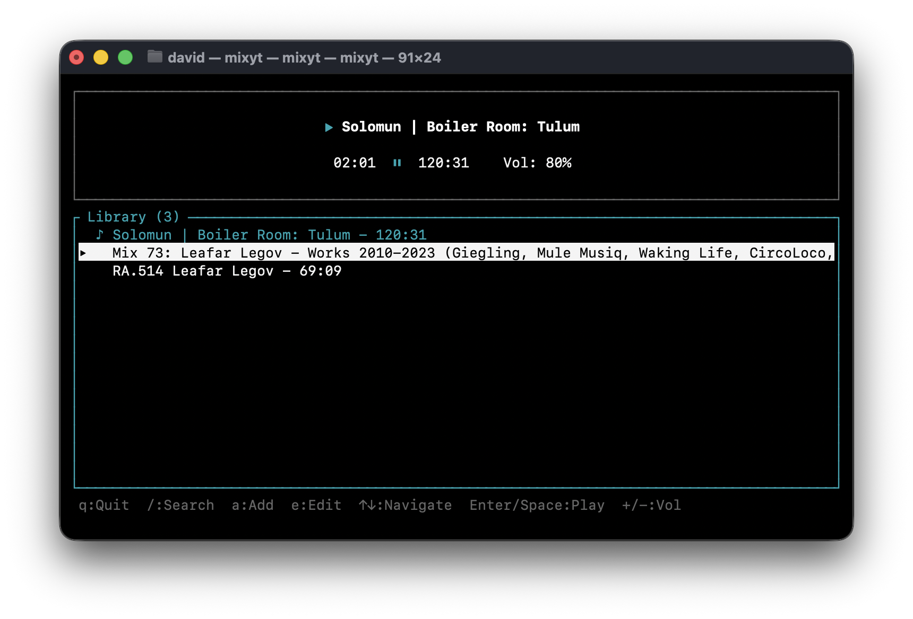

# mixyt

A CLI tool for saving and playing YouTube audio from the terminal.

**macOS only**



## Install

```bash
brew install yt-dlp ffmpeg
curl -fsSL https://raw.githubusercontent.com/davidhariri/mixyt/main/install.sh | sh
```

## Usage

```bash
# Add a track
mixyt add "https://youtube.com/watch?v=..."

# Open the player
mixyt
```

**Keyboard shortcuts:**
- `↑↓` Navigate
- `←→` Seek
- `Space` Play/pause
- `/` Search
- `a` Add track
- `e` Rename track
- `q` Quit

For all CLI commands: `mixyt help`
